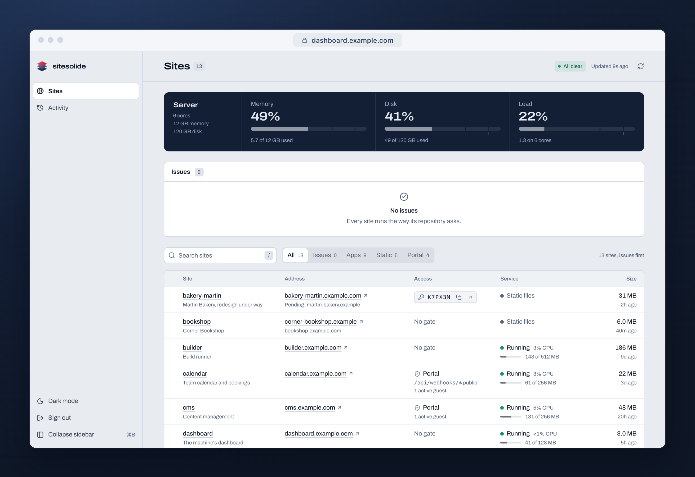
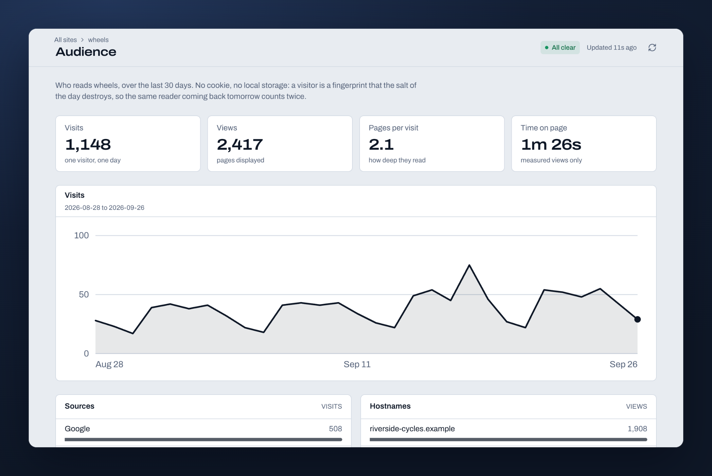
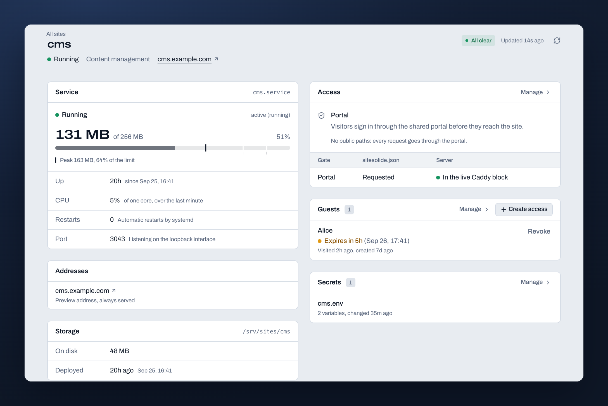
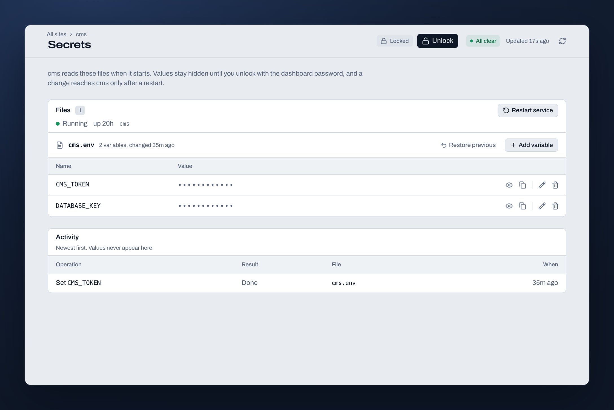
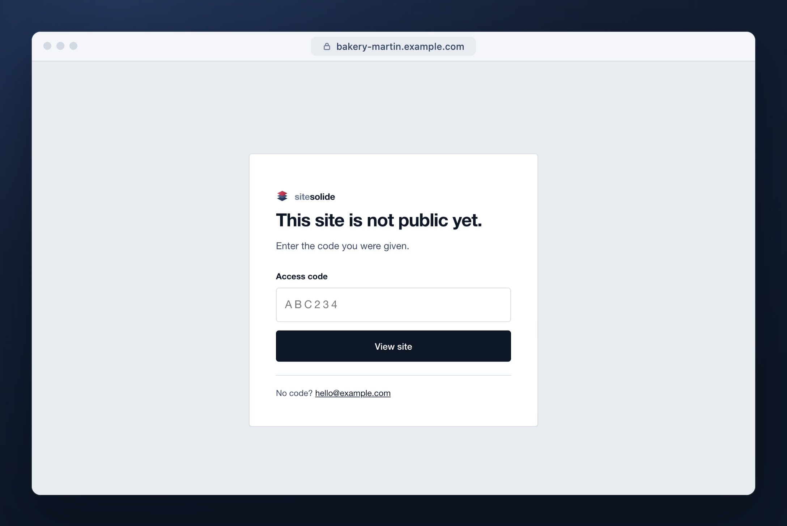

<h1>
  <picture>
    <source media="(prefers-color-scheme: dark)" srcset="docs/assets/logo-dark.svg">
    
  </picture>
</h1>

**Deploy every project you have to one server you own.**

Run `sitesolide deploy` in a folder and it is live on HTTPS. Static sites and
apps in any language, your clients' own domains, private previews, secrets and
cookieless analytics, with a dashboard that shows all of it. The ease of Vercel, the bill of
a single VM.



## One command

```console
$ cd shop && sitesolide deploy
-> project shop, service
-> build (GOOS=linux GOARCH=amd64 go build -o shop .)
-> system user and directories
-> systemd unit
-> application code
-> public files
-> Caddy lock, shared with the dashboard's gatekeeper
-> manifest
-> declared secrets
   present  /etc/sitesolide/shop.env
-> service restart
-> Caddy fragment, through the validated path
-> verify
   https://shop.example.com/ 200
```

It builds, pushes the code, installs a hardened systemd unit, writes the Caddy
block, restarts the service and checks that the site answers. A Caddy change that
would break a site is rolled back on the spot. A project is a folder with a
`sitesolide.json`:

```json
{
  "slug": "shop",
  "build": "GOOS=linux GOARCH=amd64 go build -o shop .",
  "start": "/srv/sites/shop/app/shop",
  "port": 3030,
  "publicDir": "public",
  "secrets": ["shop.env"]
}
```

Anything that listens on a port deploys the same way: Node, Python, Go, Ruby, a
compiled binary. `start` is simply the command systemd runs.

## Everything a small fleet needs

<table>
  <tr>
    <td width="50%" valign="top">
      <br>
      <b>Analytics without cookies.</b> A 2.5 kB script, visits counted on your
      own machine, no consent banner, no third party.
    </td>
    <td width="50%" valign="top">
      <br>
      <b>Every site on one page.</b> Its service and memory, its addresses, who
      can get in, and what it reads at startup.
    </td>
  </tr>
  <tr>
    <td width="50%" valign="top">
      <br>
      <b>Secrets that never touch git.</b> Set them in the dashboard and restart
      the service in one click. They live on the server, nowhere else.
    </td>
    <td width="50%" valign="top">
      <br>
      <b>Private previews.</b> <code>sitesolide lock</code> keeps a client's site
      behind a six-character code until launch day.
    </td>
  </tr>
</table>

- **HTTPS everywhere.** A wildcard certificate for your zone, and certificates
  issued on demand for your clients' domains.
- **Client domains.** `sitesolide domain --activate` moves a site onto its own
  domain once DNS points at your machine.
- **A portal for your own tools.** One password in front of your private apps,
  with time-limited access for guests.
- **Real isolation.** Each project runs as its own user, sees only its own
  folder, and cannot reach its neighbours over the loopback.
- **Nothing to rent.** No container runtime, no control plane, no per-seat
  pricing. A `cx33` at Hetzner (4 vCPU, 8 GB, about €16 a month) serves a few
  dozen projects.

## Get started

You need a domain, a VM with SSH, and [Bun](https://bun.com) on your laptop to
run the CLI.

```bash
git clone https://github.com/cthiriet/sitesolide && cd sitesolide
ln -sf "$PWD/bin/sitesolide.ts" ~/.local/bin/sitesolide
sitesolide init --server you@203.0.113.10 --zone example.com --email you@example.com
```

[docs/install.md](docs/install.md) takes you from a blank account to a first
deployed project in about half an hour, Terraform included.

## Documentation

- [Install](docs/install.md), from nothing to a first deployment
- [How it works](docs/concepts.md), the parts and who may touch what
- [The manifest](docs/manifest.md), every key of `sitesolide.json`
- [Commands](docs/commands.md), everything the CLI does
- [Secrets](docs/secrets.md), where they live and why

## License

MIT, see [LICENSE](LICENSE). Contributions welcome, see
[CONTRIBUTING.md](CONTRIBUTING.md).
