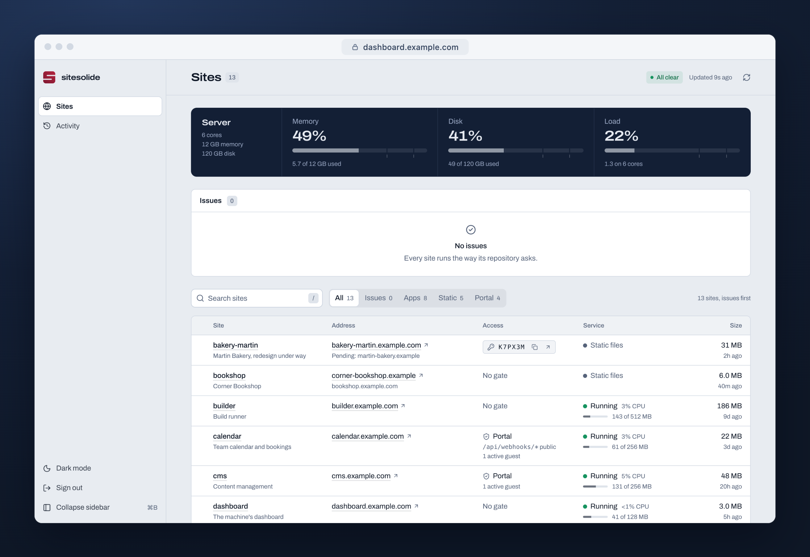

<h1>
  <picture>
    <source media="(prefers-color-scheme: dark)" srcset="docs/assets/logo-dark.svg">
    
  </picture>
</h1>

**A small cloud for the software your team and its agents write, on one server
you own.**

Internal tools, dashboards, prototypes: `sitesolide deploy` in a folder, typed
by you or run by an agent, puts it live on HTTPS, behind your company's
sign-in, shared with exactly the people who need it. One machine, no
containers, no per-seat pricing.



## Quick start

You need a domain on Cloudflare, and a Hetzner Cloud token or any Debian 13
machine you reach as root.

```bash
curl -fsSL https://github.com/cthiriet/sitesolide/releases/latest/download/install.sh | sh
```

```bash
sitesolide machine create --provider hetzner --name web
```

```bash
sitesolide setup root@203.0.113.10 --zone example.com --email you@example.com
```

```bash
cd your-project && sitesolide deploy
```

One executable, no Bun and no clone. `setup` hardens the machine, creates the
DNS records and installs everything, and can be run again at any time.
[docs/install.md](docs/install.md) explains each step and the tokens they read.
A new release later: install it the same way, then `sitesolide upgrade`
redeploys what changed, see [docs/upgrading.md](docs/upgrading.md).

## What you get

- **HTTPS for every project**, at `<project>.example.com`, and on a client's own
  domain once its DNS points at your machine.
- **Apps in any language.** A static site, or anything that listens on a port:
  Node, Python, Go, Ruby, a binary, each confined to its own user and folder.
- **Company sign-in, shared like a doc.** Google Workspace, Microsoft Entra, Okta
  or any OpenID Connect provider in front of private apps, opened to people or a
  whole domain: `sitesolide share alice@example.com`. See [portal/README.md](portal/README.md).
- **Team tokens instead of root SSH.** Colleagues and agents deploy with a
  personal, scoped, revocable token; only the owner holds SSH.
- **Secrets on the server**, never in git, set from the dashboard, which restarts
  the service in one click.
- **Backups.** Every project's data snapshotted hourly, SQLite copied
  consistently, optionally to an encrypted bucket, restored from the dashboard.
- **A monitor** that checks every site each minute; give it a heartbeat and it
  notices the machine itself dying. See [monitor/README.md](monitor/README.md).
- **Agents first-class.** The CLI speaks `--json`, every error carrying a hint,
  and `sitesolide mcp` serves deploy, logs and sharing to Claude Code, Codex or
  Cursor.

## Documentation

- [Install](docs/install.md): from nothing to a first deployment
- [Setup](docs/setup.md): what `sitesolide setup` checks and changes, step by step
- [A machine](docs/machine.md): a VM ordered from Hetzner, and the token it needs
- [How it works](docs/concepts.md): the parts, and who may touch what
- [The manifest](docs/manifest.md): every key of `sitesolide.json`
- [Commands](docs/commands.md): everything the CLI does
- [Team](docs/team.md): deploying with a token instead of SSH
- [Secrets](docs/secrets.md): where they live, and why never in git
- [Agents](docs/agents.md): `--json`, the MCP server and the skill
- [Upgrading](docs/upgrading.md): from one release to the next on a running machine

An agent starts with [llms.txt](llms.txt).

## License

MIT, see [LICENSE](LICENSE). Contributions welcome, see
[CONTRIBUTING.md](CONTRIBUTING.md).
