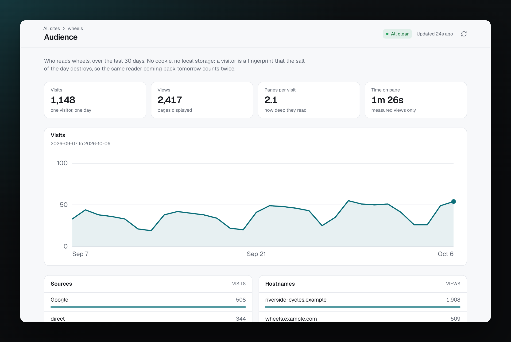
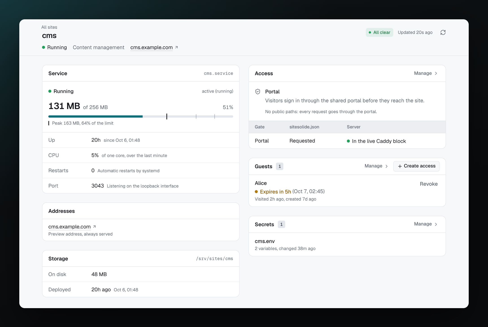
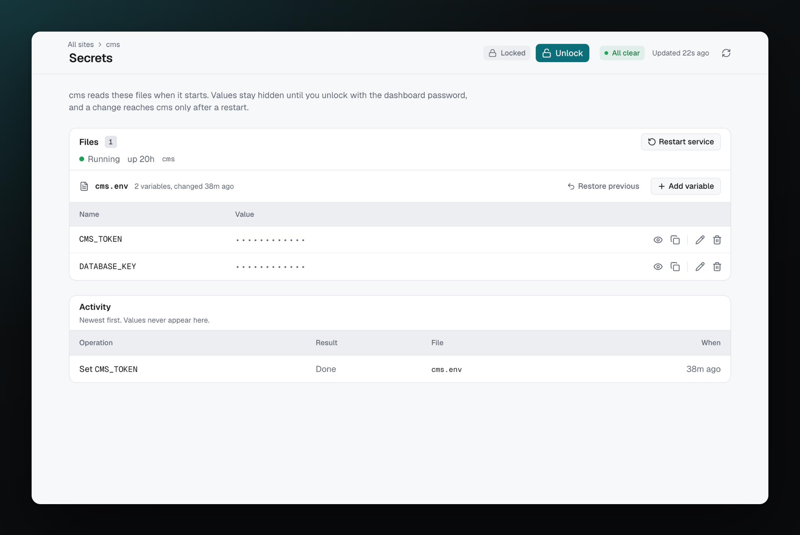
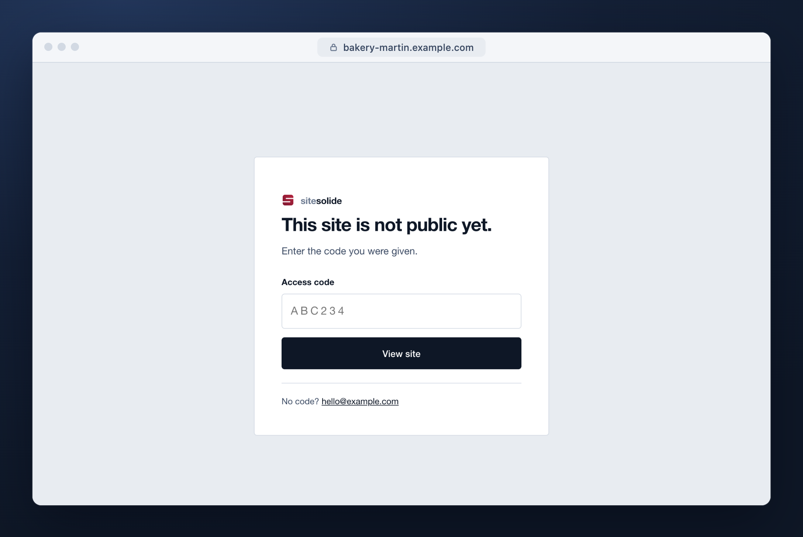

<h1>
  <picture>
    <source media="(prefers-color-scheme: dark)" srcset="docs/assets/logo-dark.svg">
    
  </picture>
</h1>

**A cloud for the small software your team and its agents write.**

Internal tools, dashboards, prototypes, a tracker for one team: software that
will only ever have a handful of users, and that an agent now writes in an
afternoon. Run `sitesolide deploy` in its folder, or let the agent run it, and
it is live on HTTPS on a server you own, behind your company's sign-in, shared
with exactly the people who need it. Static sites and apps in any language,
secrets, backups and cookieless analytics, with a dashboard that shows all of
it. The ease of Vercel, the bill of a single VM.


## One command

```console
$ cd shop && sitesolide deploy
-> project shop, service
-> build (GOOS=linux GOARCH=amd64 go build -o shop .)
-> system user and directories
-> systemd unit
-> application code
-> public files
-> Caddy lock, shared with the dashboard's gatekeeper
-> manifest
-> declared secrets
   present  /etc/sitesolide/shop.env
-> service restart
-> Caddy fragment, through the validated path
-> verify
   https://shop.example.com/ 200
```

It builds, pushes the code, installs a hardened systemd unit, writes the Caddy
block, restarts the service and checks that the site answers. A Caddy change that
would break a site is rolled back on the spot. A project is a folder with a
`sitesolide.json`:

```json
{
  "slug": "shop",
  "build": "GOOS=linux GOARCH=amd64 go build -o shop .",
  "start": "/srv/sites/shop/app/shop",
  "port": 3030,
  "publicDir": "public",
  "secrets": ["shop.env"]
}
```

Anything that listens on a port deploys the same way: Node, Python, Go, Ruby, a
compiled binary. `start` is simply the command systemd runs. A project made of
several processes, a front, an API, a worker, declares them under `services`,
and each one gets its unit, its port and its paths.

## Made for teams and their agents

- **Sign in with your company account.** Google Workspace, Microsoft Entra,
  Okta or any OpenID Connect provider in front of every private app, which
  receives who is signed in in `X-Sitesolide-User` and writes not one line of
  authentication. See [portal/README.md](portal/README.md).
- **Share it like a doc.** Per site: only you, specific people, or everyone at
  your company's domain, from the dashboard or with
  `sitesolide share alice@acme.com`. Removing someone closes the door at their
  next request.
- **Deploy without root.** Colleagues and agents get a personal, scoped,
  revocable token; the machine installs their project in its own sandbox, and
  nobody but the owner ever holds SSH. See [docs/team.md](docs/team.md).
- **Agents welcome.** `sitesolide detect` writes the manifest a folder implies,
  every command speaks `--json`, and `sitesolide mcp` serves deploy, logs and
  sharing as tools to Claude Code, Codex or Cursor. See
  [docs/agents.md](docs/agents.md).
- **Egress you decide.** An app reaches only the hosts its manifest lists, and
  calls a company API through a connector whose credential it never holds. See
  [egress/README.md](egress/README.md).
- **Data that survives.** Every project's data is snapshotted hourly, SQLite
  copied consistently, optionally to an encrypted bucket, and restored from the
  dashboard in one click. See [dashboard/src/backup/README.md](dashboard/src/backup/README.md).
- **Knows when it breaks.** Caddy restarts itself however it stopped, and a
  monitor checks every site each minute and pings a heartbeat that notices the
  machine itself dying. See [monitor/README.md](monitor/README.md).
- **One audit log.** Who deployed, who shared what with whom, who signed in
  where, who touched a secret, a connector or a backup, on one page.

## And everything a small fleet needs

<table>
  <tr>
    <td width="50%" valign="top">
      <br>
      <b>Analytics without cookies.</b> A 2.5 kB script, visits counted on your
      own machine, no consent banner, no third party.
    </td>
    <td width="50%" valign="top">
      <br>
      <b>Every site on one page.</b> Its service and memory, its addresses, who
      can get in, and what it reads at startup.
    </td>
  </tr>
  <tr>
    <td width="50%" valign="top">
      <br>
      <b>Secrets that never touch git.</b> Set them in the dashboard and restart
      the service in one click. They live on the server, nowhere else.
    </td>
    <td width="50%" valign="top">
      <br>
      <b>Private previews.</b> <code>sitesolide lock</code> keeps a client's site
      behind a six-character code until launch day.
    </td>
  </tr>
</table>

- **HTTPS everywhere.** A wildcard certificate for your zone, and certificates
  issued on demand for your clients' domains.
- **Client domains.** `sitesolide domain --activate` moves a site onto its own
  domain once DNS points at your machine.
- **A portal for your own tools.** One password in front of your private apps,
  with time-limited access for guests.
- **Real isolation.** Each project runs as its own user, sees only its own
  folder, and cannot reach its neighbours over the loopback.
- **Nothing to rent.** No container runtime, no control plane, no per-seat
  pricing. A `cx33` at Hetzner (4 vCPU, 8 GB, about €16 a month) serves a few
  dozen projects.

## Get started

You need a domain, a VM with SSH, and [Bun](https://bun.com) on your laptop to
run the CLI.

```bash
git clone https://github.com/cthiriet/sitesolide && cd sitesolide
ln -sf "$PWD/bin/sitesolide.ts" ~/.local/bin/sitesolide
sitesolide init --server you@203.0.113.10 --zone example.com --email you@example.com
```

[docs/install.md](docs/install.md) takes you from a blank account to a first
deployed project in about half an hour, Terraform included.

## Documentation

- [Install](docs/install.md), from nothing to a first deployment
- [How it works](docs/concepts.md), the parts and who may touch what
- [The manifest](docs/manifest.md), every key of `sitesolide.json`
- [Commands](docs/commands.md), everything the CLI does
- [Deploying as a team member](docs/team.md), with a token instead of SSH
- [Secrets](docs/secrets.md), where they live and why
- [Agents](docs/agents.md), for Claude Code, Codex or Cursor: `--json`, an MCP server, a skill
- [Upgrading](docs/upgrading.md), from one release to the next on a running machine

## License

MIT, see [LICENSE](LICENSE). Contributions welcome, see
[CONTRIBUTING.md](CONTRIBUTING.md).
